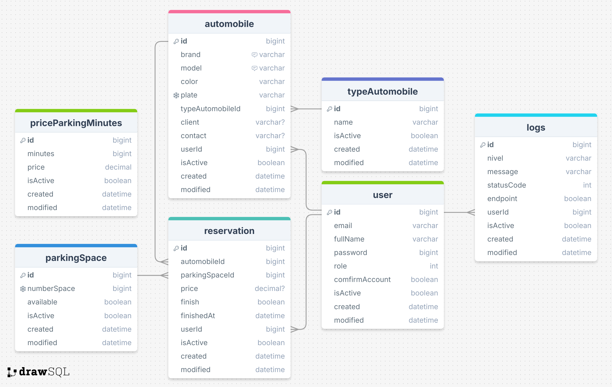

# 🚘 Az Auto Parking 🚘 By: Jhonatan Azevdo

## 🗃️ Database


[Database diagram link](https://drawsql.app/teams/jhonatan-azevedo/diagrams/az-auto-parking-by-dev-azevedo)

Api for get data automobile
var type = 'carros' | 'motos' | 'caminhoes'
https://parallelum.com.br/fipe/api/v1/{type}/marcas
Return: 
```bash
{
    "codigo": "14",
    "nome": "Cross Lander"
}
```
https://parallelum.com.br/fipe/api/v1/{type}/marcas/{codigo}/modelos
Return: 
```bash
{
    "codigo": 437,
    "nome": "147 C/ CL"
}
```